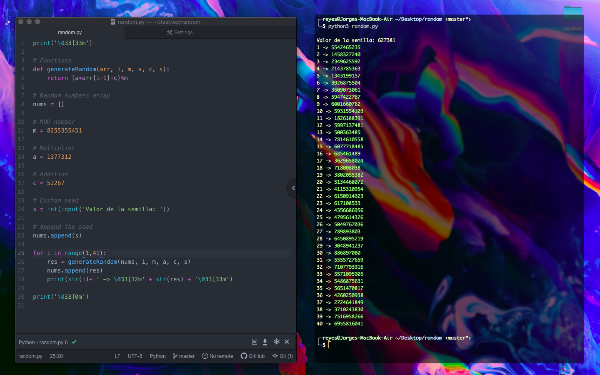
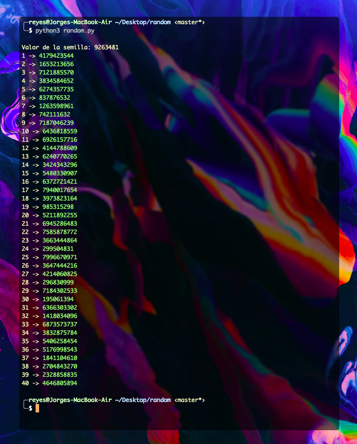

# Generador de números aleatorios

Decidimos trabajar con el generador de números aleatorios ya que es un tema muy interesante que es muy usado en la programación.

Nuestro equipo está conformado por: **Jorge Reyes**, **Jorge Vázquez** y **Augusto Reyes**.

### Descripción
En la computación es básicamente imposible obtener un número 100% aleatorio. Debido a esto los programadores que requieren usar números "aleatorios" se las ingenian para poder generarlos de alguna forma. 

En este caso, utilizamos el **método congruencial lineal**. El cual toma la fórmula:

$$
x_{n} = (ax_{n-1} + c) \space mod \space m
$$

> Dónde $m$ es el módulo, $a$ es el multiplicador, $c$ es el incremento  y $s$ es la semilla.

Los métodos para generar números aleatorios utilizan el concepto de semilla, el cual es un número *arbitrario*, y con sólo ese número se pueden generar números *pseudo-aleatorios*. Mientras más grandes sean los números utilizados para $m$ y $a$ mejores resultados obtenemos.

> Se les llama números *pseudo-aleatorios* porque en realidad no son aleatorios. Si conocemos la fórmula usada para generarlos, junto con la semilla, podríamos predecir que números se van a generar. Es meramente una función matemática.

### Capturas de pantalla del programa

### Conclusión

En este trabajo aprendimos uno de los métodos para generar números *pseudo-aleatorios* como también construir el programa que efectúa las operaciones para generar los números.

Investigando y leyendo sobre el tema logramos entender la importancia y utilidad de los números *pseudo-aleatorios*. Así como también, logramos entender que ya teniendo nuestro programa que genera números *pseudo-aleatorios* podemos "limitarlos" para conseguir números en el rango que nosotros deseemos. Por ejemplo, si necesitamos números aleatorios entre el $0$ y el $100$ podemos aplicar al resultado final de nuestro generador de números una operación de $mod \space 100$ para que nos limite los resultados al rango deseado.